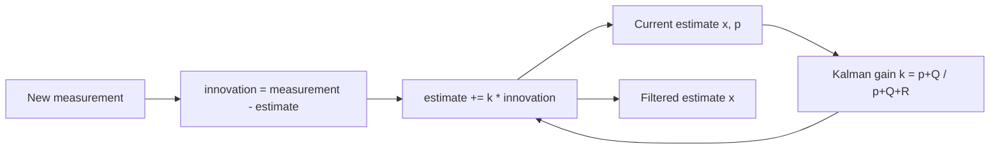

# AceLand Kalman Filter
A blittable, Burst-ready scalar Kalman filter for smoothing noisy values in Unity.

## In One Line
Noise in, smooth out — at Burst speed.

## Overview
`AceLand.KalmanFilter` gives you a tiny, allocation-free Kalman filter that removes jitter from any stream
of noisy measurements: sensor input, network positions, mouse deltas, physics readings, and so on.

The whole filter is a **blittable `struct`**. The value math (add / subtract / scale) is supplied by a
value-type **adapter** that is baked into the generic signature, so there is **no interface dispatch and no
boxing**. That means the exact same filter runs three ways with zero code changes:

- as a plain field in ordinary managed `MonoBehaviour` code,
- inside a **Burst-compiled Job** (`IJob`, `IJobParallelFor`),
- as data on an **ECS component** processed by an `ISystem`.

Built-in adapters cover `float`, `Vector2/3/4` and `float2/3/4`, and you can add a filter for any of your
own `unmanaged` types by writing a four-method adapter.

## Package Info
| | |
| --- | --- |
| display name | AceLand Kalman Filter |
| package name | com.aceland.kalmanfilter |
| latest version | 3.0.0 |
| namespace | Aceland.KalmanFilter |
| git repository | [https://github.com/parsue/com.aceland.kalmanfilter.git](https://github.com/parsue/com.aceland.kalmanfilter.git) |
| unity | 2022.3 or newer |
| dependencies | com.unity.mathematics: 1.3.2   com.unity.burst: 1.8.25   com.unity.collections: 2.1.4 |

---

## Why Use It
- **Zero allocation.** The filter is a value type, so it never touches the garbage collector — safe to use
  every frame, per entity, per particle.
- **Genuinely Burst-ready.** No managed references and no virtual calls, so the math actually gets Burst
  SIMD optimisation instead of just wearing a `[BurstCompile]` badge.
- **One filter, three worlds.** The same struct works in classic `MonoBehaviour` code, in the Jobs system,
  and in ECS — you never rewrite it to "go DOTS".
- **Batteries included.** `float`, `Vector2/3/4` and `float2/3/4` filters are one factory call away, plus a
  ready-made [`KalmanBatchJob`](burst-jobs-and-ecs.md) for filtering thousands of signals in parallel.
- **Extensible.** Any `unmanaged` type becomes filterable by writing a small [value adapter](custom-value-adapters.md).

---

## How It Works
A Kalman filter keeps a running best estimate `x` and how much it trusts that estimate (the covariance `p`).
Each new measurement nudges the estimate; how far it moves is decided by the **Kalman gain** `k`, which is
derived from two tuning knobs:

- **Q** — process noise: how quickly you believe the true value can change.
- **R** — measurement noise: how noisy you believe each reading is.

Higher `R` (or lower `Q`) → smoother but slower to react. Lower `R` (or higher `Q`) → snappier but noisier.



The type-specific arithmetic (`Subtract`, `Scale`, `Add` on the diagram) is the only part that differs
between `float`, `Vector3`, `float3`, etc. That work is delegated to the value adapter, which the compiler
inlines — so a `Vector3` filter is just the scalar algorithm applied component-wise, with no branching on type.

---

## Quick Start

### 1. Create a filter and feed it measurements
Pick the factory method for your value type. Store the returned filter **by its concrete `struct` type**
(use `var`) and call `Update` with each new reading.



```csharp
using Aceland.KalmanFilter;
using UnityEngine;

public class SmoothSensor : MonoBehaviour
{
    // Store the concrete struct (via var). Do NOT store it as IKalmanFilter<float>,
    // that would box it and lose the Burst / allocation-free benefits.
    private KalmanFilter<float, FloatAdapter> _filter;

    private void Awake()
    {
        // q = process noise, r = measurement noise (bigger r = smoother).
        _filter = Kalman.CreateFloatFilter(q: 1e-5f, r: 1e-2f);
    }

    private void Update()
    {
        float noisyReading = ReadSensor();
        float smoothed = _filter.Update(noisyReading);
        Debug.Log(smoothed);
    }

    private float ReadSensor() => 0f;
}
```



```csharp
using Aceland.KalmanFilter;
using UnityEngine;

public class SmoothPosition : MonoBehaviour
{
    private KalmanFilter<Vector3, Vector3Adapter> _filter;

    private void Awake() => _filter = Kalman.CreateVector3Filter(r: 5e-2f);

    private void Update()
    {
        // e.g. a jittery network / tracked position
        Vector3 noisy = GetNetworkPosition();
        transform.position = _filter.Update(noisy);
    }

    private Vector3 GetNetworkPosition() => transform.position;
}
```



```csharp
using Aceland.KalmanFilter;
using Unity.Mathematics;

// float2 / float3 / float4 are the recommended types when the result will be
// used inside Burst-compiled Jobs or ECS.
public struct PositionFilter
{
    private KalmanFilter<float3, Float3Adapter> _filter;

    public void Init() => _filter = Kalman.CreateFloat3Filter(r: 5e-2f);

    public float3 Step(float3 noisy) => _filter.Update(noisy);
}
```




`q`, `r` and `p` all have sensible defaults (`1e-6f`, `1e-3f`, `1f`). Start there and only tune `r` up if
the output is still too jittery, or down if it feels laggy.


### 2. Tune, inspect and reset at runtime
Every filter exposes its live state and lets you retune the noise without recreating it.

```csharp
// Read the current estimate, covariance and gain.
var (x, p, k) = _filter.GetCurrentValues();

// Retune on the fly. Pass float.NaN (the default) to leave a value unchanged.
_filter.Update(measurement, newQ: 2e-5f, newR: 1e-2f);

// Force the estimate to a known value (e.g. after a teleport).
_filter.SetValues(x: knownValue, p: 1f, k: 0f);

// Start over from zero.
_filter.Reset();
```


Because the filter is a `struct`, it is copied by value. If you pass it into a method **by value**, the
caller's copy is *not* updated. Keep it in a field, or pass it with `ref`, so state persists between frames.


### 3. Filter a whole batch at once
When you already have a buffer of samples, feed a `NativeArray<T>` in one call. This is the same code path
the Jobs system uses.

```csharp
using Unity.Collections;

var samples = new NativeArray<float>(count, Allocator.Temp);
// ... fill samples ...

var filter = Kalman.CreateFloatFilter();
float finalEstimate = filter.Update(samples);   // processes index 0 -> last

samples.Dispose();
```

---

## Custom Value Types
Need to filter your own struct (a quaternion, a color, a domain-specific value)? Implement a small
[value adapter](custom-value-adapters.md) and pass it to `Kalman.Create<T, TAdapter>(...)`.

## Burst, Jobs & ECS
For parallel filtering of thousands of signals, and how to keep everything Burst-compiled, see
[Burst, Jobs & ECS](burst-jobs-and-ecs.md) and the ready-made `KalmanBatchJob`.

---

## Best Practices
- **Store the concrete struct type** (via `var` or the explicit `KalmanFilter<T, TAdapter>`), never the
  `IKalmanFilter<T>` interface — the interface boxes the value and kills the Burst / no-GC benefits.
- **Keep the filter in a field** (or pass by `ref`); passing by value gives the callee a throwaway copy.
- **Tune with `r` first.** Raising measurement noise `r` is the most intuitive smoothness dial.
- **Prefer `float2/3/4`** over `Vector2/3/4` when the data lives inside Jobs / ECS.
- **Reset after discontinuities** (teleports, respawns) so the filter doesn't slowly chase the jump.
- **Register your generic job type** with `[assembly: RegisterGenericJobType(...)]` when scheduling a
  filter over a custom adapter — see [Burst, Jobs & ECS](burst-jobs-and-ecs.md).
